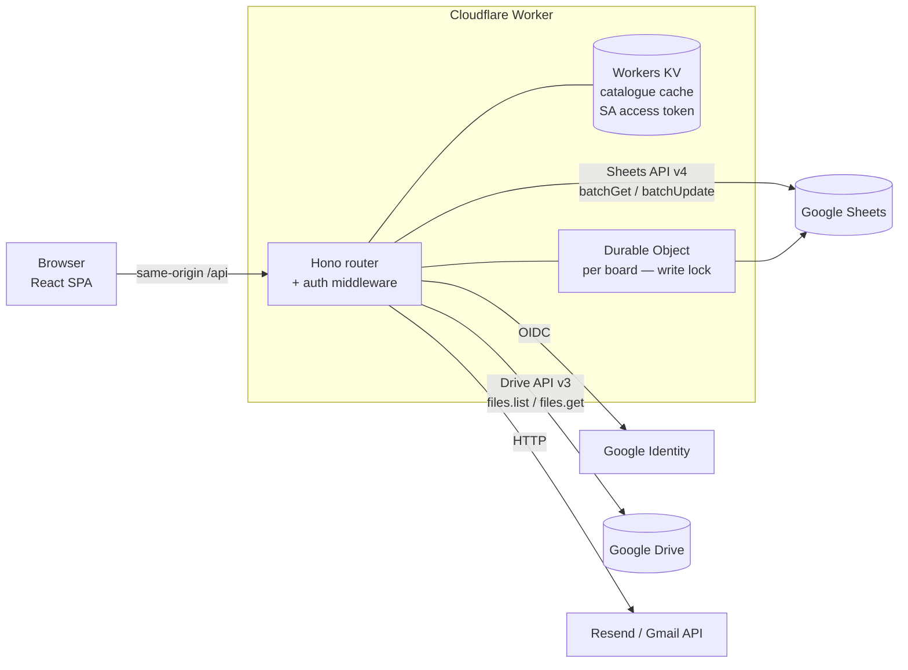
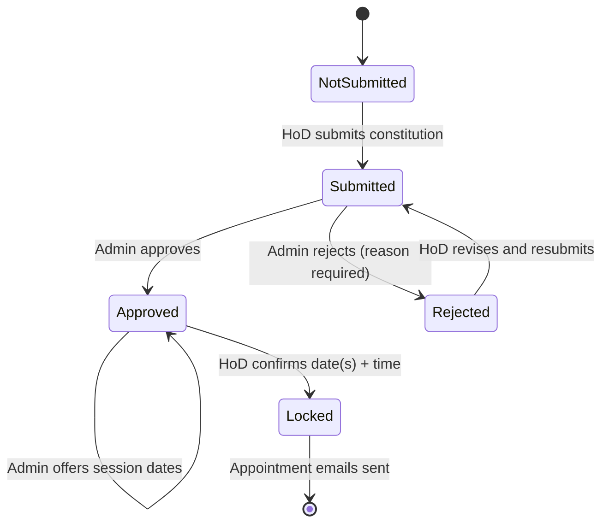

# QPSB Portal — Architecture Plan (React on Cloudflare, Google as system of record)

**Status:** Proposal for approval. No code written yet.
**Date:** 2026-08-14

---

## 1. Decisions taken as given

| Decision | Choice | Consequence this plan must handle |
|---|---|---|
| System of record | **Google Sheets** (workflow data) + **Google Drive** (QP files) | No transactions, no joins, hard API quotas, ~200–800 ms per call |
| Hosting | **Cloudflare** | Workers runtime — not Node. The `googleapis` npm SDK is unusable; no filesystem; CPU/memory ceilings on ZIP work |
| Deliverable now | Written plan only | — |

Two things follow directly from that pairing and drive most of the design below:

1. **Sheets is the slowest and least safe part of the system.** Every architectural choice here is about putting a caching layer and a write-serialisation layer between React and Sheets, so the UI feels instant and two admins clicking *Approve* at once cannot corrupt a row.
2. **Cloudflare Workers is not Node.** Google auth must be done by signing a JWT with WebCrypto, and the "download the whole QPSB folder as a base64 ZIP" feature cannot be ported as-is. Both are addressed explicitly (§6, §9).

---

## 2. Recommended stack

### Frontend
| Concern | Choice | Why this one |
|---|---|---|
| Framework | **React 19 + TypeScript** | As requested. TS is non-negotiable here — the board state machine and the Drive folder shapes are exactly where untyped code rots. |
| Build | **Vite** | Fastest DX; first-class Cloudflare Workers integration via `@cloudflare/vite-plugin`. |
| App shape | **SPA** (not SSR) | Every screen is behind login and personalised. SSR buys nothing, costs Worker CPU on every page view. |
| Routing | **React Router v7** (declarative mode) | Small, stable, well-understood. TanStack Router is a fine alternative if you want typed route params. |
| Server state | **TanStack Query** | The single most valuable library for this app. Sheets calls are slow; Query gives caching, background refetch, request dedupe, and `invalidateQueries` after each mutation — which is what makes the approve/reject flow feel instant. |
| Forms + validation | **React Hook Form + Zod** | Zod schemas are **shared** with the Worker, so the "2 or 3 faculty" rule is defined once and enforced on both sides. |
| UI | **Tailwind CSS v4 + shadcn/ui** | You own the component source, so the SSSIHL identity (`#0c5196`, the logo header, the status pills) stays exact. Radix underneath gives keyboard and screen-reader behaviour the current portal lacks. |
| Tables | **TanStack Table** | The Pre/Post-QPSB check grids are wide matrices that want sorting, filtering by status, and sticky headers. |
| Icons | **lucide-react** | The current HTML has empty spans where emoji/icons were meant to be. |

### Backend (same Cloudflare Worker)
| Concern | Choice | Why |
|---|---|---|
| API framework | **Hono** | Built for Workers, tiny, Express-like, excellent TS inference, first-class Zod validator middleware. |
| Deployment unit | **One Worker** serving static assets (`assets` binding) **and** `/api/*` | Same origin ⇒ no CORS, cookies just work, one `wrangler deploy`. |
| Session | **HttpOnly, Secure, SameSite=Lax cookie** holding a signed JWT (`jose`) | Stateless, no session-store round trip on every request. 8-hour expiry. |
| Login | **Google OIDC, Authorization Code + PKCE**, `hd` restricted to the institute domain | Preserves today's model where identity *is* the Google email. |
| Google API credentials | **Service account**, RS256 JWT signed with `crypto.subtle` → token exchange → token cached in KV for 55 min | The only workable path on Workers. Share the Sheet and the Drive root with the service account address; add domain-wide delegation only if mail must be sent *as* a real person. |
| Read cache | **Workers KV** | Course catalogue, faculty list, department map — read constantly, changed rarely. TTL + explicit invalidation on write. |
| Write safety | **Durable Objects** — one instance keyed by `boardId` | Serialises all writes to a board row. This is the fix for Sheets having no transactions (§7). |
| Email | **Resend** (HTTP API) or **Gmail API** with domain-wide delegation | MailChannels' free Workers tier ended in 2024. Gmail API is better if appointment letters must come from the Controller's own address. |
| Secrets | `wrangler secret put` | SA private key, OAuth client secret, session signing key, Resend key. Never in `wrangler.toml`. |

### Quality gates
Vitest + `@cloudflare/vitest-pool-workers` (runs Worker tests in the real runtime) · MSW for client tests · Playwright for the three critical journeys · ESLint + Prettier · GitHub Actions → preview deploy per PR, production on `main`.

**Plan note:** budget for **Workers Paid ($5/mo)**. Drive listing and ZIP streaming will exceed the free plan's 10 ms CPU limit.

---

## 3. System diagram



---

## 4. Sheet schema (normalised)

The current sheets almost certainly stash lists inside single cells (`availableDates`, selected faculty, `"2026-09-14 | 9:30 AM;2026-09-15 | 9:30 AM"`). Restructure before the rewrite — it is cheap now and expensive later.

| Tab | Columns | Notes |
|---|---|---|
| `Access` | `email`, `role` (`admin`\|`hod`), `department` | One row per department a HoD owns, not a CSV cell |
| `Programmes` | `degree`, `degreeShort`, `department`, `programme`, `driveFolderId` | The catalogue the cascading dropdowns read |
| `Courses` | `courseCode`, `courseTitle`, `degree`, `department`, `programme`, `semester`, `driveFolderId` | |
| `Faculty` | `email`, `name`, `campus`, `department`, `isActive` | |
| `Boards` | `boardId`, `degree`, `department`, `programme`, `status`, `chairpersonEmail`, `submittedBy`, `submittedAt`, `actionBy`, `actionAt`, `rejectionReason`, `sessionTime`, `version`, `updatedAt` | `boardId` = stable slug, e.g. `mtech-cs-2026` |
| `BoardMembers` | `boardId`, `facultyEmail`, `role` (`chair`\|`member`) | Replaces the CSV-in-a-cell |
| `BoardDates` | `boardId`, `date`, `offeredBy`, `isSelected` | Replaces `availableDates` / `selectedDate` strings |
| `AuditLog` | `timestamp`, `actorEmail`, `action`, `boardId`, `beforeJson`, `afterJson` | Append-only. Currently absent — you cannot answer "who approved this and when" beyond one overwritten cell |

All Sheets access goes through a single `src/server/repositories/*` module. If Sheets ever becomes the bottleneck you rewrite that folder only — nothing above it changes.

---

## 5. Domain model: the board state machine

Today the transitions live implicitly in scattered `if (combo.status === …)` branches in the HTML. Make it explicit and enforce it server-side:



Encode as a table of `(fromStatus, action, requiredRole) → toStatus`. Every mutation endpoint checks it. The current portal only hides buttons in the UI — nothing stops a crafted request from approving an already-locked board.

---

## 6. Auth and authorisation

**Login:** `/api/auth/login` → Google consent (PKCE, `hd=<institute domain>`) → `/api/auth/callback` verifies the ID token signature against Google's JWKS, checks `hd` and `email_verified`, looks the email up in `Access`, and issues the session cookie carrying `{ email, name, role, departments[] }`.

**Every request:** Hono middleware verifies the cookie and populates `c.var.user`. Two guards compose on top:
- `requireRole('admin')` — admin portal endpoints
- `requireBoardAccess(boardId)` — HoD may only touch boards in their own departments

**Why this matters:** the current portal passes `department` and `degree` as plain strings from the client to `approveBoard()` / `submitBoardSelection()`. Unless Apps Script re-checks server-side, any authenticated HoD can post another department's payload. The rewrite must resolve authority from the **session**, never from the request body — the client sends `boardId`, and the server derives everything else.

**Roles:** `admin` (Controller of Examinations / office) sees the Admin Portal and both check types; `hod` sees Constitution and Post-QPSB check for their own programmes. Add `viewer` (read-only audit) now — it costs nothing and someone always asks for it.

---

## 7. The concurrency problem, and the fix

Sheets has no transactions. Two admins on the Submitted queue can both read `status=Submitted`, one approves, one rejects, and the second write silently wins. The same race applies to a HoD resubmitting while an admin approves.

**Fix — Durable Object per board.** All writes for a board route to `DO(boardId)`, which the Workers runtime guarantees is a single instance processing one request at a time. Inside it:

1. Read the current row (`version`, `status`).
2. Validate the transition against §5 and compare `version` against the client's.
3. Write the row + `AuditLog` entry, increment `version`.
4. Invalidate the KV cache key for that board.

Mismatched version ⇒ `409 Conflict`; the client refetches and shows "This board was updated by someone else — reloading." Reads bypass the DO entirely and go straight to the cache, so this costs nothing on the hot path.

---

## 8. API surface

All under `/api`, all JSON, all Zod-validated on both sides.

```
GET    /api/me                                → session, role, departments
GET    /api/boards                            → role-scoped list + summary counts
GET    /api/boards/:boardId                   → detail incl. courses, members, dates
POST   /api/boards/:boardId/constitution      → { facultyEmails[], version }   [hod]
POST   /api/boards/:boardId/approve           → { version }                     [admin]
POST   /api/boards/:boardId/reject            → { reason, version }             [admin]
POST   /api/boards/:boardId/dates             → { dates[] }                     [admin]
POST   /api/boards/:boardId/schedule          → { dates[], time, version }      [hod]
POST   /api/boards/:boardId/appointment-email → { }                             [admin]

GET    /api/catalog/degrees
GET    /api/catalog/departments?degree=
GET    /api/catalog/programmes?degree=&department=

GET    /api/checks/pre?boardId=               → per-course folder matrix
GET    /api/checks/post?boardId=              → per-course subfolder matrix
GET    /api/downloads/qpsb?boardId=           → streamed ZIP  (see §9)
```

Two deliberate changes from the Apps Script API: **`boardId` replaces the `(department, degree, programme)` triple** everywhere (authorisation becomes one lookup instead of three string comparisons), and **every mutation carries `version`** for the optimistic-concurrency check.

### Making Sheets feel fast
- One `spreadsheets.values.batchGet` pulls every tab in a single round trip — not seven calls.
- Catalogue tabs (`Programmes`, `Courses`, `Faculty`) cached in KV, 15-min TTL, busted on write.
- `Boards` + `BoardMembers` cached 30 s; a mutation busts its own key immediately, so the user always sees their own write.
- Drive listings cached in the Cache API for 60 s keyed by folder ID.
- Quotas to design against: Sheets **300 reads/min/project, 60/min/user**; Drive **~12 000 queries/min/project**. Batching plus KV keeps a 40-department admin dashboard to roughly *one* Sheets read per 15 minutes rather than one per card.

---

## 9. The file checker and the ZIP download

**Checks.** Both check types are Drive `files.list` calls with `q = '<folderId>' in parents and trashed = false` and a tight `fields` mask. Fan out across courses with a concurrency cap of ~8 (`p-limit`-style) so 30 courses resolve in a few seconds rather than serially. The folder names are magic strings today (`'1) Syllabus'`, `'4) Raw QP'`, `'Final Synopsis'` — note the UI labels it "Scrutinized Synopsis" while the key is `Final Synopsis`); lift them into one typed `FOLDER_SPEC` constant so a rename is a one-line change.

**Downloads — this is the one feature that cannot be ported as written.** Apps Script built a ZIP in memory and shipped it to the browser as base64. A Worker has ~128 MB memory and a CPU ceiling; base64 also inflates payload by 33 % and the browser then holds the whole thing in a `Uint8Array`. Recommended replacement, in order of preference:

1. **Stream a store-only ZIP.** `fflate`'s streaming writer, Drive files fetched 3-at-a-time and piped into a `ReadableStream` response. No compression — PDFs and DOCX are already compressed, so you lose ~nothing and spend almost no CPU. Memory stays bounded regardless of folder size. This covers the realistic case.
2. **Fallback for very large boards:** enqueue a Cloudflare Queues job, build the archive into R2, email a signed link. Add only if (1) proves insufficient.
3. **Cheapest of all:** for admins, just deep-link to the Drive folder — they already have access, and Drive's own UI downloads folders.

Prototype option (1) in Phase 0. It is the single highest-risk item in this plan.

---

## 10. Frontend structure

```
public/
  logo.png            # served as a static asset — see "Static assets" below
  favicon.ico
src/
  client/
    routes/
      constitution/     # Tab 1 — HoD board constitution + date confirmation
      file-checker/     # Tab 2 — pre/post check matrices
      admin/            # Tab 3 — dashboard, approvals, scheduling
    components/ui/      # shadcn primitives
    components/         # BoardCard, StatusBadge, FacultyPicker, CheckMatrix, …
    lib/                # api client, query keys, date formatting (ONE copy)
  server/
    index.ts            # Hono app + assets
    routes/             # mirrors §8
    middleware/         # auth, role guards, error mapping
    repositories/       # sheets.ts, drive.ts  ← the only Google-aware code
    google/             # sa-token.ts (WebCrypto JWT), sheets-client, drive-client
    domain/             # board state machine, permissions
  shared/
    schemas/            # Zod — imported by BOTH sides
    types.ts
```

**Static assets (logo, favicon, fonts).** Anything static lives in `public/` and is committed to the repo as a normal `.png` / `.jpg`. Vite fingerprints it at build time (`logo-a1b2c3.png`) and the Worker's `assets` binding serves it straight from Cloudflare's edge cache — no Worker CPU, no API call, no auth needed.

This **drops `getLogoBase64()` entirely.** Apps Script had to inline the logo as base64 because a sandboxed `<iframe>` cannot reference Drive files directly; that constraint doesn't exist here. Concretely, the header becomes:

```tsx
import logoUrl from '@/assets/logo.png';   // or just 

```

Benefits over the current approach: the logo renders on first paint instead of after a `google.script.run` round trip (no more `display:none` flash), it's cached by the browser across sessions, and base64 no longer inflates the payload by ~33 %. Use **PNG with transparency** for the logo; keep it under ~100 KB and ship a `logo@2x.png` via `srcset` if it looks soft on high-DPI screens. Same for any future letterhead image used in the appointment email templates — those get a public absolute URL rather than a data URI, since several mail clients block inline base64 images.

**Navigation:** the current tab bar is fine as a concept but should become real routes (`/constitution`, `/checker`, `/admin`) so the browser back button and deep links work. Role decides which routes mount, and the admin's "hide Tab 1, default to Tab 3" behaviour becomes a redirect rule.

---

## 11. Defects in the current portal to fix during the rewrite

Found while reading the existing HTML — worth carrying forward as explicit acceptance criteria:

1. **`formatDateDMY` / `formatDateTimeDisplay` are defined three times** in three `<script>` blocks; the last definition silently wins. One shared util.
2. **The admin table shows raw `selectedDate`** (`2026-09-14 | 9:30 AM;…`) while the HoD view formats it via `formatLockedDisplay`. Same data, two renderings.
3. **The "2 or 3 senior faculty" rule is not enforced.** `enforceFacultyLimit()` was reduced to updating a counter — the comment even says the limit logic was removed. A HoD can submit 1 or 9. Enforce in the shared Zod schema *and* in the Worker.
4. **Dead code:** `toggleTimeSelector`, `adminDatesForm`, `adminApprove`/`adminReject`/`adminSetDates` (superseded by the `ap_*` versions), `triggerPDFMasterDownload`, `t1ScrollToStatus`.
5. **No audit trail.** `actionBy`/`actionTime` are single overwritten cells. Add the append-only `AuditLog`.
6. **Authorisation trusts client-supplied `department`/`degree`.** Fixed by §6.
7. **Typos in user-facing copy:** "File availabel", "Scrutinized Synopsis" vs the `Final Synopsis` key, the stray `</strong>` in the disclaimer, `.error` styled blue.
8. **Missing accessibility:** tabs aren't ARIA tabs, the loading overlay traps nothing and announces nothing, status colour is the only signal for pass/fail (fails colour-blind users — pair every colour with an icon and text).
9. **No mobile layout.** HoDs will open this on a phone. The check matrices need horizontal scroll containers; the board cards need to stack.

---

## 12. Delivery phases

| Phase | Scope | Exit criterion |
|---|---|---|
| **0 — Spikes** (~3 d) | ~~Service-account JWT via WebCrypto~~ **✅ done**; Sheets `batchGet` round-trip timing; **streaming ZIP prototype**; restructure the sheets per §4 | All three spikes green, or ZIP falls back to plan 9(2) |
| **1 — Foundation** (~1 w) | Repo, Vite + Worker + Hono, Tailwind/shadcn theme with SSSIHL identity, Google login end to end, `/api/me`, role-gated routing, CI/preview deploys | A HoD and an admin can log in and see an empty, correctly-gated shell |
| **2 — Read-only parity** (~1.5 w) | Repositories + KV caching, board list/detail, admin dashboard with summary cards, constitution cards read-only | Every screen renders live production data; no writes yet — safe to demo alongside the old portal |
| **3 — Write workflows** (~1.5 w) | Durable Object, state machine, submit / approve / reject / offer dates / confirm schedule, audit log, 409 handling | Full constitution lifecycle runs on real data in a copy of the sheet |
| **4 — File checker** (~1 w) | Pre and Post matrices, Drive fan-out, folder-spec constants, empty/error states | Results match the old portal course-for-course on a sample of programmes |
| **5 — Downloads + email** (~1 w) | Streaming ZIP, appointment emails with templates, delivery logging | An admin downloads a full board archive and sends appointment letters |
| **6 — Cutover** (~1 w) | Parallel run, HoD walkthrough, docs, Apps Script switched to read-only with a banner pointing at the new URL | Two weeks of parallel operation with no discrepancy |

Roughly **7–8 weeks** for one developer. Phases 2 and 4 are independent and can run in parallel with a second pair of hands.

---

## 12a. Spike log

**Spike 1 — service-account JWT via WebCrypto: PASSED (2026-08-14).**

The question was whether a Worker can authenticate to Google at all, given
that `google-auth-library` is Node-only. It can. `src/server/google/sa-token.ts`
imports a PKCS8 PEM and signs an RS256 assertion using `crypto.subtle`, and
`sa-token.test.ts` verifies the resulting signature against the public key
**inside workerd** (5 tests, green) — so a pass here is a pass in production.
The tests generate their own throwaway RSA keypair; no credentials required.

Still unverified: the token exchange itself (a form POST to
`oauth2.googleapis.com/token`) and whether the service account has actually
been granted access to the spreadsheet and Drive folders. Both need real
credentials. The exchange is the low-risk half; **the sharing/permissions
audit is the part that historically bites** — see the risk table below.

Also settled while installing: `typescript-eslint` caps TypeScript at
`<6.1.0`, so the toolchain pins TS 5.9 rather than 7.x. React Router 8
requires **Node ≥ 22.22.0**.

**Spikes 2 (Sheets timing) and 3 (streaming ZIP) remain open** — spike 2 needs
the real spreadsheet ID, spike 3 can be prototyped against any Drive folder.

---

## 13. Risks

| Risk | Likelihood | Mitigation |
|---|---|---|
| ZIP streaming hits Worker CPU/memory limits | Medium | Spike in Phase 0; store-only compression; Queues + R2 fallback |
| Sheets read quota (60/min/user) trips during peak QPSB week | Medium | KV caching + `batchGet`; monitor; a D1 read-replica mirror is the escape hatch (§14) |
| Service-account access to Drive folders is incomplete | High | Audit sharing in Phase 0 — this always bites; a shared drive is far more robust than per-folder shares |
| Sheet restructure (§4) breaks other consumers | Medium | Inventory who else reads these sheets *before* touching them; keep legacy columns during parallel run |
| Institute IT restricts OAuth client creation / SA keys | Medium | Raise with IT in week 1; nothing else can proceed without it |
| Apps Script logic has undocumented rules not visible in the HTML | High | Read the `.gs` source before Phase 3. The pasted file is the client half only — the server half is where the real business rules live |

---

## 14. The escape hatch, if Sheets becomes the bottleneck

Keep Sheets as the system of record (your requirement stands), but add **Cloudflare D1 as a read model**: a Cron Trigger syncs Sheets → D1 every few minutes and after every write. Reads then hit SQLite at the edge — sub-millisecond, no quota, real `WHERE` clauses — while writes still land in Sheets and the office keeps its familiar spreadsheet. Because all Google access is already behind `repositories/`, this is an additive change, not a rewrite. Don't build it on day one; design so it stays cheap to add.

---

## Open questions for you

1. **Can I see the Apps Script `.gs` source?** The pasted file is the client only. Validation rules, folder-path conventions, and email templates all live server-side and I'd be guessing at them otherwise.
2. **Does anything else read these sheets** (other scripts, Data Studio, manual reports)? That decides how aggressively §4 can restructure.
3. **Institute Google Workspace domain**, and can IT issue an OAuth client + service account key?
4. **Are the QP folders on a Shared Drive or in someone's My Drive?** Shared Drive makes service-account access far simpler.
5. **Appointment emails — must they come from a real person's address** (needs domain-wide delegation) or is a no-reply system address acceptable (Resend is then simpler)?
6. **Roughly how many courses per board and how large is a full QPSB folder in MB?** This sizes the ZIP decision.
